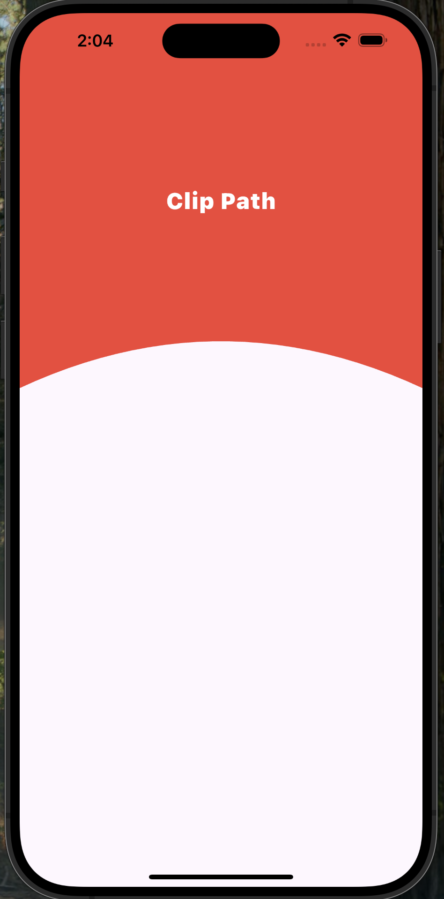

# Flutter ClipPath

Flutter ClipPath sample.

### Full source code

[Github](https://github.com/maratib/flutter-clip-path)

<table width="100%">
<tr><td valign="top">

```dart
class WaveClipper extends CustomClipper<Path> {
  @override
  Path getClip(Size size) {
    final path = Path();

    double w = size.width;
    double h = size.height;

    path.lineTo(0, 0);
    path.lineTo(0, h);
    path.quadraticBezierTo(w * 0.5, h - 100, w, h);
    path.lineTo(w, h);
    path.lineTo(w, 0);

    path.close();
    return path;
  }

  @override
  bool shouldReclip(CustomClipper<Path> oldClipper) => false;
}

```

</td><td valign="top">



</td></tr>
</table>
